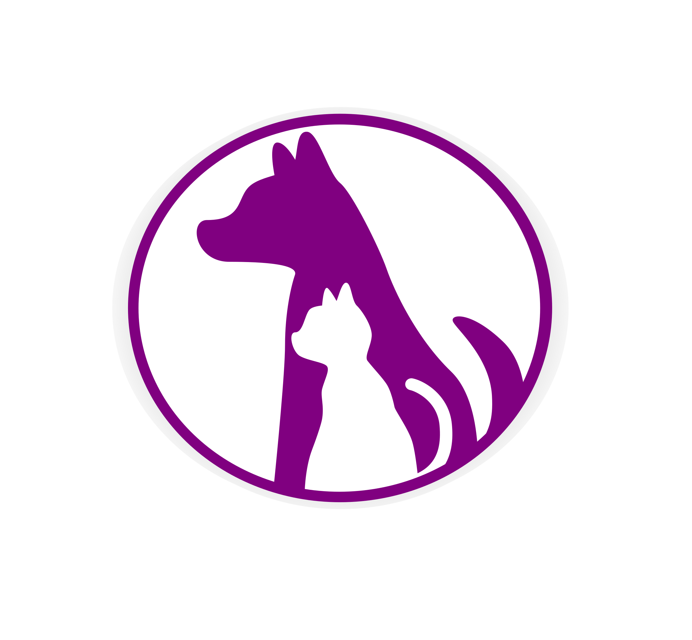

<!--
*** Obrigado por estar vendo o nosso README. Se você tiver alguma sugestão
*** que possa melhorá-lo ainda mais dê um fork no repositório e crie uma Pull
*** Request ou abra uma Issue com a tag "sugestão".
*** Obrigado novamente! Agora vamos rodar esse projeto incrível :D
-->


<!-- PROJECT SHIELDS -->
[![Contributors][contributors-shield]]()
[![MIT License][license-shield]][license-url]


<!-- PROJECT LOGO -->
<br />
<p align="center">
  <a href="https://github.com/adotando-pet/adotandopet-back-end">
    
  </a>

  <h3 align="center">Adotando.Pet</h3>

  <p align="center">
    <a href="https://github.com/adotando-pet/adotandopet-back-end">Reportar um Bug</a>
    ·
    <a href="https://github.com/adotando-pet/adotandopet-back-end">Solicitar Funcionalidade</a>
  </p>
</p>


<!-- TABLE OF CONTENTS -->
## Tablea de Conteúdo

* [Sobre o Projeto](#sobre-o-projeto)
  * [Feito com](#feito-com)
* [Começando](#começando)
  * [Pré-requisitos](#pré-requisitos)
  * [Instalação](#instalação)
* [Contribuição](#contribuição)
* [Licença](#licença)
* [Contato](#contato)


<!-- ABOUT THE PROJECT -->
## Sobre o Projeto

(Aqui vai uma descrição sobre o projeto)

### Feito Com
Abaixo seguem as ferramentas utilizadas no desenvolvimento do projeto Adotando Pet, especificamente para o Back-end:

* [NodeJS](https://nodejs.org/en/) - Node.js é um interpretador de código JavaScript com o código aberto, focado em migrar o Javascript do lado do cliente para servidores;
* [AdonisJS](https://adonisjs.com/) - O AdonisJS é um framework de NodeJS altamente robusto que nos permitirá agilizar muito o desenvolvimento do nosso app;
* [Sentry](https://sentry.io/welcome/) - O Sentry é um rastreador de erros de código aberto que ajuda os desenvolvedores a monitorar e corrigir falhas em tempo real;
* [Redis](https://redis.io/) - O Redis é uma estrutura de dados do servidor. É open-source, em rede, na memória e armazena chaves com durabilidade opcional;
* [Moment](https://momentjs.com/) - O Moment é uma Biblioteca para parse, validação, manipulação e leitura de Data e Hora em Javascript;
* [MongoDB](https://www.mongodb.com/) - O MongoDB é um software de banco de dados orientado a documentos livre, de código aberto e multiplataforma, escrito na linguagem C++ e classificado como um programa de Banco de Dados NoSQL;
* [Eslint](https://eslint.org/) - O ESLint é uma ferramenta de lint plugável para JavaScript e JSX;
* [EditorConfig](https://editorconfig.org/) - O EditorConfig é um formatador de arquivos e coleções em forma de Plugin para Editores de código/texto com o objetivo de manter um padrão de código consistente entre diferentes editores, IDE's ou ambientes;
* [adonis-kue](https://github.com/nrempel/adonis-kue) - O adonis-kue é uma biblioteca que disponibiliza uma forma fácil de iniciar com uma fila de "Job's" no AdonisJS;
* [voca](https://vocajs.com/) - A Biblioteca Voca oferece algumas funções úteis para manipulação de Strings, como: change case, trim, pad, slugify, latinise, sprintf'y, truncate, escape e muito mais;
* [useragent](https://github.com/3rd-Eden/useragent#readme) - O Useragent permite que você analise strings do agente do usuário com alto desempenho e precisão usando expressões regulares sintonizadas manualmente para correspondência de navegador;
* [geoip-lite](https://github.com/bluesmoon/node-geoip) - O módulo geoip usa um arquivo binário para procurar endereços IP e retornar o país, a região e a cidade para os quais ele mapeia;
* [adonis-acl](https://github.com/enniel/adonis-acl) - O adonis-acl adiciona permissões baseadas em funções para o Sistema de Autenticação do AdonisJS.


<!-- GETTING STARTED -->
## Começando

Para conseguir rodar uma cópia local da aplicação siga os passos abaixo.

### Pré-requisitos

Antes mesmo de ir para as configurações da aplicação, há algumas coisas que você tem que configurar em sua máquina, abaixo segue uma lista do que é necessário:

* NodeJS + NPM

Para instalar o NodeJS juntamente com o NPM você pode fazer o download do site oficial através [desse link](https://nodejs.org/en/download/).

Para verificar a instalação execute o comando:

```sh
node -v && npm -v
```

O retorno deve ser algo como:

```
v8.11.3
6.7.0
```

* Adonis CLI

```sh
npm install -g @adonis/cli
```

Para verificar a instalação execute o comando:

```sh
npm list -g --depth=0
```

O retorno deve ser algo como:

```
@adonisjs/cli@<versão>
```

* Banco de Dados

Vamos ver duas formas de criar as instâncias dos Bancos de Dados.

#### A primeira maneira: Docker

A maneira mais fácil e rápida para configurar o banco de dados é usando o [Docker](https://www.docker.com/), você pode ver como instalar no seu Sistema Operacional [nesse link](https://docs.docker.com/install/), especificamente na barra lateral.

Com o Docker instalado e rodando, agora vamos iniciar as instâncias dos Bancos de Dados, lembrando que caso seja a primeira vez que você utiliza o Docker os comandos abaixo vão demorar para finalizar, pois eles vão baixar as imagens dos Bancos de Dados para sua máquina:

##### Iniciando o Postgres
```sh
docker run --name adotandopet_pg -e POSTGRES_DBNAME=adotandopet -p 5432:5432 -d -t kartoza/postgis
```

---

Como alternativa ao **Postgres** você pode utilizar o **MySQL**, e para isso basta executar o comando abaixo:

##### Iniciando o MySQL
```sh
docker run --name adotandopet_mysql -p 3306:3306 -e MYSQL_ROOT_PASSWORD=root -d mysql
```

---

##### Iniciando o MongoDB
```sh
docker run --name adotandopet_mongo -d -p 27017:27017 -p 28017:28017 -e AUTH=no tutum/mongodb
```

##### Iniciando o Redis
```sh
docker run --name adotandopet_redis -p 6379:6379 -d redis:alpine
```

Para verificar se as imagens estão funcionando corretamente basta executar o comando:

```sh
docker ps -a
```

O retorno deve ser algo como abaixo, ressaltando que provavelmente o **CONTAINER ID** deve estar diferente da tabela abaixo e pode ser que o seu esteja com o **MySQL** no lugar do **Postgres**:

| CONTAINER ID | IMAGE           | ... | PORTS                                              | NAMES             |
| ------------ | --------------- | --- | -------------------------------------------------- | ----------------- |
| 75c1a6d57372 | redis:alpine    | ... | 0.0.0.0:6379->6379/tcp                             | adotandopet_redis |
| 2ea9914cf83f | kartoza/postgis | ... | 0.0.0.0:5432->5432/tcp                             | adotandopet_pg    |
| 8fea2d30c5a4 | tutum/mongodb   | ... | 0.0.0.0:27017->27017/tcp, 0.0.0.0:28017->28017/tcp | adotandopet_mongo |

Caso desligue sua máquina, para não ter que executar o comando `docker run` novamente basta executar o comando `docker start <container_id>`, seguindo o exemplo da tabela acima ficaria:

```sh
docker start 75c1a6d57372
docker start 2ea9914cf83f
docker start 8fea2d30c5a4
```

#### A segunda maneira: Instalando o Serviço

A segunda maneira para ter as instâncias dos Bancos de Dados configuradas é instalar manualmente em sua máquina, para isso seguem os links de instalação de cada um deles:

##### Instalando o Postgres

[Link para Download e Instalação do Postgres](https://www.postgresql.org/download/)

---

Como alternativa ao **Postgres** você pode utilizar o **MySQL**:

##### Instalando o MySQL

[Link para Download e Instalação do MySQL](https://dev.mysql.com/downloads/mysql/)

---

##### Instalando o MongoDB

[Link para Download e Instalação do MongoDB](https://www.mongodb.com/download-center/community)

##### Instalando o Redis

[Link para Download e Instalação do Redis](https://redis.io/download)

E para testar o funcionamento da segunda maneira você pode verificar nos serviços sendo executados na sua máquina se os Bancos de Dados estão em execução ou então usar uma GUI, que é uma interface gráfica, como demonstrado abaixo

* Interface de Banco de Dados

Abaixo segue a lista das Interfaces mais usadas e recomendadas para cada Banco de Dados:

[Dbeaver](https://dbeaver.io/download/) - GUI para MySQL e Postgres

[Robo 3T](https://robomongo.org/download) - GUI para MongoDB

[FastoRedis](https://fastoredis.com/anonim_users_downloads) - GUI para Redis

### Instalação

1. Clone o repositório

```sh
git clone https://github.com/adotando-pet/adotandopet-back-end.git
```

2. Instale os pacotes do NPM

```sh
npm install
```

3. Duplique o arquivo `.env.example` e renomeie para `.env`
```
.env.example -> .env
```

4. Certifique-se de estar com o serviço do **Postgres** ou **MySQL**, **MongoDB** e **Redis** em execução

5. (Opcional) Crie uma conta no [Sentry](https://sentry.io/welcome/) e siga as etapas ate chegar na tela que ele te fornece uma URL do DSN, pegue essa URL e modifique na variável **SENTRY_DSN** no `.env`, por exemplo:

```
SENTRY_DSN=https://472cfc4f528c49887650e25f6f1e4e8b8@sentry.io/112305
```

6. (Opcional) Crie uma conta no [Mailtrap](https://mailtrap.io/) para usar um serviço de e-mail fake, para testes, ao criar um **Inbox** ele te fornecerá uma lista com os dados para configuração, use esses dados nas variáveis **MAIL_HOST**, **MAIL_PORT**, **MAIL_USERNAME** e **MAIL_PASSWORD** no `.env`, por exemplo:

```
MAIL_HOST=smtp.mailtrap.io
MAIL_PORT=2525
MAIL_USERNAME=765bb123498f4f
MAIL_PASSWORD=dc123e0598e2f7
```

7. Caso você não tenha feito a configuração de senha no MongoDB não será necessário modificar as variáveis do `.env` mas caso tenha feito optado por adicionar autenticação, basta modificar as variáveis **MONGO_USER**, **MONGO_PASSWORD** e **MONGO_URL**, por exemplo:

```
MONGO_HOST=127.0.0.1
MONGO_PORT=27017
MONGO_USER=root
MONGO_PASSWORD=root
MONGO_URL=mongodb://${MONGO_USER}:${MONGO_PASSWORD}@${MONGO_HOST}:${MONGO_PORT}
```

8. O mesmo se aplica ao Redis, caso você não tenha adicionado uma senha na instalação não necessita de modificação, mas caso tenha, basta modificar a variável **REDIS_PASSWORD** no `.env`, por exemplo:

```
REDIS_HOST=127.0.0.1
REDIS_PORT=6379
REDIS_PASSWORD=root
```

9. E como última configuração antes de rodarmos o projeto vamos configurar o Banco de Dados principal, que por padrão a aplicação está usando o Postgres.

* Caso você queria usar o **Postgres** basta modificar as variáveis **DB_USER** e **DB_PASSWORD**, por exemplo:

```
DB_CONNECTION=pg
DB_HOST=127.0.0.1
DB_PORT=5432
DB_USER=root
DB_PASSWORD=root
DB_DATABASE=adotandopet_pg
```

*Obs.: Se você estiver usando Docker, o usuário e a senha padrão que ele cria é `docker`.*

* Caso queira mudar a conexão para **MySQL** são necessárias duas modificações, a primeira é trocar as bibliotecas de conexão, a segunda é mudar a porta de conexão, por exemplo:

```sh
npm uninstall pg
npm install mysql
```

```
DB_CONNECTION=mysql
DB_HOST=127.0.0.1
DB_PORT=3306
DB_USER=root
DB_PASSWORD=root
DB_DATABASE=adotandopet_mysql
```

* E por último, se decidir usar o SQLite, basta desinstalar os pacotes do **Postgres** ou **MySQL**, por exemplo:

```sh
npm uninstall pg
```
ou
```sh
npm uninstall mysql
```

E depois configurar as variáveis no `.env`, por exemplo:

```
DB_CONNECTION=sqlite
DB_HOST=127.0.0.1
DB_PORT=
DB_USER=
DB_PASSWORD=
DB_DATABASE=adotandopet_sqlite
```

10. Agora com as configurações finalizadas vamos começar criando toda a estrutura do Banco de Dados executando o comando:

```sh
adonis migration:run
```

E o resultado deve ser algo como:

```
migrate: 1551710766069_file_schema.js
migrate: 1551710766070_user.js
migrate: 1551710766071_token.js
migrate: 1551710766072_advertisement_schema.js
migrate: 1551710766073_advertisement_file_schema.js
migrate: 1551710777556_comments_schema.js
migrate: 1551710823768_adoption_schema.js
migrate: 1551710841305_phone_schema.js
migrate: 1551712422457_address_schema.js
migrate: 1551762243433_create_permissions_table.js
migrate: 1551762243442_create_roles_table.js
migrate: 1551762243445_create_permission_role_table.js
migrate: 1551762243447_create_permission_user_table.js
migrate: 1551762243450_create_role_user_table.js
Database migrated successfully in 1.02 s
```
11. Gerar KEY da aplicação:

```sh
adonis key:generate
```
12. E o último passo para rodar a aplicação é executar o servidor do AdonisJS, e podemos fazer isso executando:

```sh
adonis serve --dev
```

O resultado deve ser:

```
SERVER STARTED
> Watching files for changes...

info: serving app on http://127.0.0.1:3333
```

12. Com tudo configurado e rodando vamos listar as rotas disponíveis na aplicação, basta executar:

```sh
adonis route:list
```

<!-- CONTRIBUTING -->
## Contribuição

Contribuições são o que fazem a comunidade open source um lugar incrível para aprender, inspirar e criar. Qualquer contribuição que você fizer será **muito apreciada**.

1. Faça um Fork do projeto
2. Crie uma Branch para sua Feature (`git checkout -b feature/FeatureIncrivel`)
3. Adicione suas mudanças (`git add .`)
4. Comite suas mudanças (`git commit -m 'Adicionando uma Feature incrível!`)
5. Faça o Push da Branch (`git push origin feature/FeatureIncrivel`)
6. Abra uma Pull Request


<!-- LICENSE -->
## Licença

Distribuído sob a licença MIT. Veja `LICENSE` para mais informações.


<!-- CONTACT -->
## Contato

Claudio Orlandi - [Github](https://github.com/cso01) - **cso.junior1996@gmail.com**

Danilo Moreira - [Github](https://github.com/danilodgm) - **dgmdanilodgm@gmail.com**

Davi Mattos - [Github](https://github.com/davimattos) - **davimattosdev@gmail.com**

Phellipe Rodrigues - [Github](https://github.com/phelliperodrigues) - **phellipephellipe@hotmail.com**

[contributors-shield]: https://img.shields.io/badge/contributors-4-orange.svg?style=flat-square
[license-shield]: https://img.shields.io/badge/license-MIT-blue.svg?style=flat-square
[license-url]: https://choosealicense.com/licenses/mit
